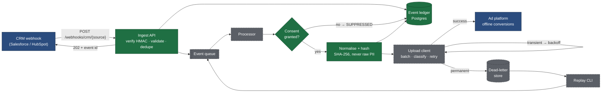
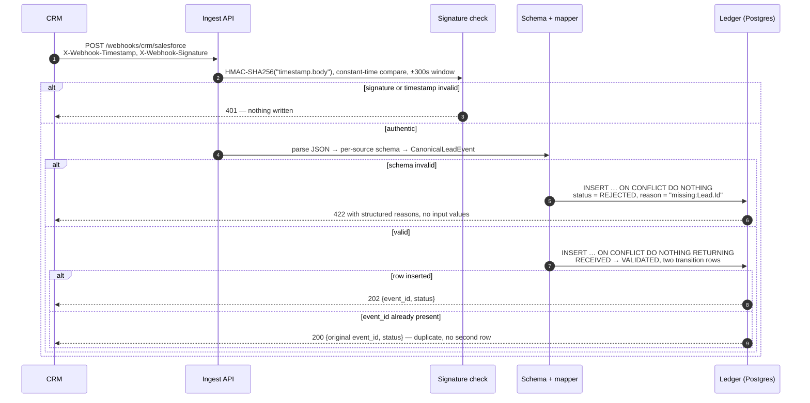
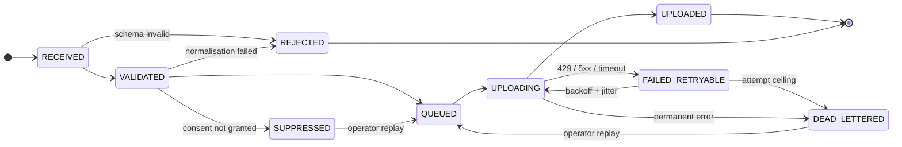

# First-Party Conversion Gateway

A server-side gateway that closes the loop between a CRM and an ad platform.
A lead form fires, a sales rep marks the lead closed-won days later, and the
ad platform never hears about it. This service receives that CRM outcome,
normalises and hashes the identifiers, gates on consent, and uploads an
offline conversion the platform can match back to the original ad click.

It is a reference implementation: the design choices are the point, and each
one is commented in the code with why that way. The full technical design is
in [docs/DESIGN.md](docs/DESIGN.md).

## Pipeline



**Green** is built and tested. **Grey (dashed)** is designed and scheduled
in the phases below. **Blue** is outside the system boundary.

## What happens on a webhook



Raw identifiers live only inside the request. The ledger row holds digests,
consent state, and lifecycle; a test dumps every column and asserts the raw
email, phone and name are absent.

## Event lifecycle

Every transition is written to an append-only table with a timestamp and a
reason code, so "where did event X end up and why" is one query.



The state machine is data ([`ALLOWED_TRANSITIONS`](src/gateway/models/status.py))
and the ledger refuses any transition not listed in it.

## The parts that are easy to get wrong

These are the decisions the codebase exists to demonstrate.

| Problem | What this implementation does |
| --- | --- |
| **Hashing that silently doesn't match.** `" Mohith@Gmail.com "` and `mohith@gmail.com` hash to unrelated values; the upload succeeds and nothing matches. | Normalisation is a set of pure functions with a [fixture table](tests/normalise/test_normalise.py) of `(input, expected, digest)` rows that reads as the spec, including gmail dot/plus rules and *not* applying them to other domains. |
| **Best-effort normalisation.** A digest of a badly-normalised phone looks like a valid attempt and drags down measurable match rate. | Every normaliser returns either the value or a typed [`RejectionReason`](src/gateway/normalise/rejection.py). A rejected record carries every failing field, not just the first. |
| **Consent that fails open.** Missing consent fields treated as "probably fine". | The [gate](src/gateway/consent/gate.py) uploads only on explicit `GRANTED` for both signals, and distinguishes *denied* from *unspecified* from *absent* so a spike in the last one is recognisable as a broken client tag. |
| **Duplicate webhooks becoming duplicate conversions.** CRMs retry aggressively and out of order. | `event_id` is the primary key; the insert is `ON CONFLICT DO NOTHING RETURNING` in one statement, so concurrent deliveries cannot both win. |
| **Replayable signatures.** A tolerance window on a timestamp header is bypassed by bumping the header. | The timestamp is inside the signed string. Bumping it invalidates the signature. |
| **Rejections vanishing into a 4xx.** A client asks why conversions are missing and there is no record. | Authenticated-but-invalid requests are written as `REJECTED` with a structured reason and are queryable at `GET /events/{id}`. |
| **PII in logs and errors.** Pydantic's validation errors include the offending input. | Error payloads carry only field path and error type. Rejection exceptions hold the field name, never the value. |

## Status

Built in phases, each committed separately.

- [x] **Phase 1** — project skeleton, normalisation + hashing, consent gate
- [x] **Phase 2** — ingest API and event ledger (HMAC verification, per-source schemas, idempotency, Alembic)
- [ ] **Phase 3** — queue abstraction (in-memory + Pub/Sub emulator), processing worker, reconciliation CLI
- [ ] **Phase 4** — upload client with error classification, backoff, partial-batch handling; mock ads API
- [ ] **Phase 5** — dead-letter store and replay CLI
- [ ] **Phase 6** — structured logging with PII redaction, Prometheus metrics, container, runbook

## Running it

```
make install   # uv sync
make run       # docker compose up (Postgres)
make migrate   # alembic upgrade head
make api       # uvicorn on :8080
make test      # pytest with coverage (floor: 90%); needs `make run`
make lint      # ruff check + format check
make typecheck # mypy --strict
make down      # docker compose down, removing volumes
```

Copy `.env.example` to `.env` first; every variable is documented there with
the phase that introduces it.

### API

```
POST /webhooks/crm/{salesforce|hubspot}
X-Webhook-Timestamp: <unix seconds>
X-Webhook-Signature: sha256=<hex HMAC-SHA256(secret, "<timestamp>.<raw body>")>
```

| Response | Meaning |
| --- | --- |
| 202 | New event, written to the ledger as `VALIDATED` |
| 200 | Duplicate delivery; the original event id is returned, nothing written |
| 422 | Authenticated but invalid; written as `REJECTED` with structured reasons |
| 401 | Signature or timestamp failed; nothing written |

`GET /events/{event_id}` returns lifecycle state, reason, and every
transition. `GET /healthz` is liveness; `GET /readyz` checks the database.

### Tests

Tests run against the real Postgres from `make run`, in a separate
`gateway_test` database that is created and migrated (down, then up) each
session. That is deliberate: the idempotency guarantee rests on Postgres'
`ON CONFLICT` semantics, and the migration is code worth exercising.

```
192 passed · 100% line and branch coverage · mypy --strict clean
```

## Layout

```
src/gateway/
├── api/            FastAPI app, routes, signature verification, per-source schemas, mappers
├── models/         Canonical event, SQLAlchemy ledger models, lifecycle state machine
├── normalise/      Pure normalisation and hashing; rejection reasons
├── consent/        Consent gate
├── ledger.py       All ledger writes; the only code that changes event state
├── queue/          (phase 3)
├── upload/         (phase 4)
├── dlq/            (phase 5)
└── observability/  (phase 6)
migrations/         Alembic
tests/              Fixture tables, state machine, HTTP integration against Postgres
docs/DESIGN.md      Technical design
```

## Stack

Python 3.11 · FastAPI · Pydantic v2 · SQLAlchemy 2 · Alembic · Postgres ·
phonenumbers · pytest · ruff · mypy --strict · uv · Docker Compose
