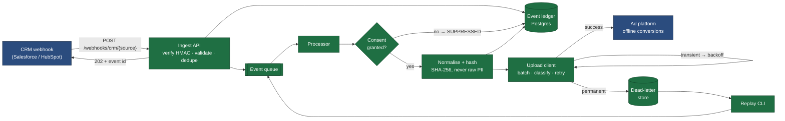
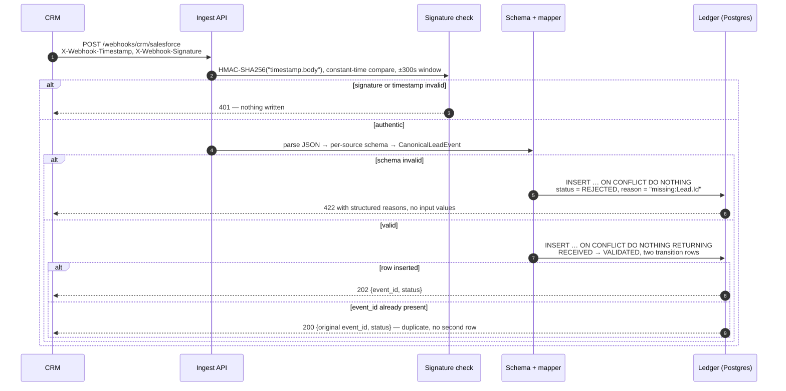
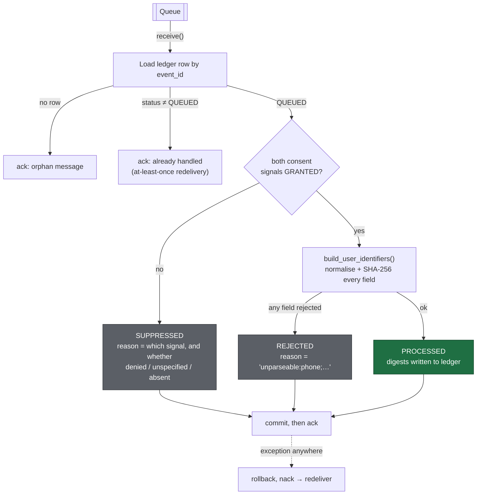
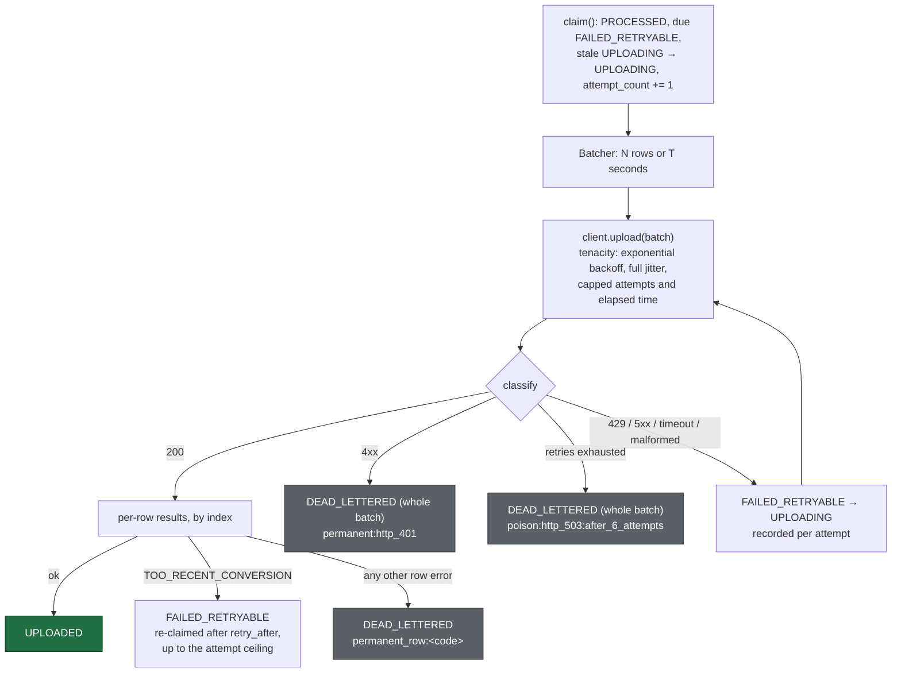
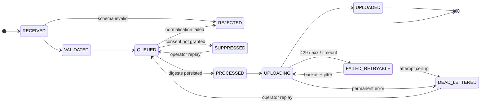

# First-Party Conversion Gateway

A server-side gateway that closes the loop between a CRM and an ad platform.
A lead form fires, a sales rep marks the lead closed-won days later, and the
ad platform never hears about it. This service receives that CRM outcome,
normalises and hashes the identifiers, gates on consent, and uploads an
offline conversion the platform can match back to the original ad click.

It is a reference implementation: the design choices are the point, and each
one is commented in the code with why that way. The full technical design is
in [docs/DESIGN.md](docs/DESIGN.md).

## Pipeline



**Green** is built and tested. **Blue** is outside the system boundary.

## What happens on a webhook



After the commit the API publishes `{event_id, raw identifiers}` to the
queue. The raw identifiers exist only on that message and only until the
worker hashes them; the ledger row holds digests, consent state, and
lifecycle. A test dumps every column and asserts the raw email, phone and
name are absent.

## What the worker does



Consent is evaluated before the identifiers are touched, so a denied user's
PII is never even normalised. Commit happens before ack, which is what makes
delivery at-least-once: a crash between the two redelivers a message whose
row is already `PROCESSED`, and the worker skips it.

The transport is an interface ([`QueuePublisher` / `QueueConsumer`](src/gateway/queue/base.py))
with two implementations: in-memory for tests, Google Cloud Pub/Sub (against
the emulator locally) for anything with two processes. `QUEUE_BACKEND` picks
one; nothing else changes.

There is no transaction spanning Postgres and the queue, so the ledger
commit goes first and the publish second. If the publish fails the event is
durable but stuck in `QUEUED`; `gateway reconcile` finds those, re-enqueues
the ones that can be recovered from the ledger alone (click-ID events), and
names the ones that need a CRM resend.

## What the uploader does

The upload stage is driven from the ledger, not the queue. A `PROCESSED`
row holds everything the platform needs, so the uploader claims rows with
`SELECT … FOR UPDATE SKIP LOCKED`, batches them, and writes each row's
outcome back. A crash anywhere leaves rows in `UPLOADING`; they are
re-claimed as stale. Two uploaders can run side by side without stepping
on each other.



**Partial failures are handled per row and the batch is never re-sent.**
The response's `results[]` has one entry per input row; each error carries
`location.fieldPathElements[].index`. Rows that succeeded are `UPLOADED`
and are not eligible for another claim, so a later cycle sends only the
rows that need it. The
[test](tests/upload/test_uploader.py) asserts the exact sequence of order
ids in every request the client made.

A whole-request transient failure (429, 5xx, timeout) is retried with the
full batch, which is safe because nothing was accepted. A malformed
response is the one ambiguous case: the platform might have accepted the
batch. It is treated as transient, and every row carries `orderId =
event_id` so the platform dedupes a re-send.

`mock_ads_api/` is a small FastAPI service that speaks the platform's
request and response shapes and fails on command (`POST /control`: 429,
500, 503, 401, timeout, malformed body, specific row indexes). It rejects
any hashed identifier that is not 64 lowercase hex characters, so it
catches the gateway's own hashing bugs before a real account would.

## Dead letters and replay

Every dead-lettering writes a `dead_letters` row alongside the ledger
transition: the exact conversion payload that was sent (digests only), the
failure class (`partial` / `permanent` / `poison`), the platform's error
code and message, and the full attempt history. The row survives replay,
so the record of what failed is not lost when it is fixed.

```
$ gateway dlq list --reason permanent_row:
    id  dead_lettered_at          source      class     event_id                    reason
     1  2026-09-22T01:17:33+00:00 salesforce  partial   salesforce:dlq-1790039848   permanent_row:CONVERSION_ACTION_NOT_FOUND

$ gateway dlq show 1            # full record as JSON
$ gateway dlq replay --id 1     # or --reason / --source / --failure-class / --since / --until
replayed 1 salesforce:dlq-1790039848
```

Replay moves the event `DEAD_LETTERED → QUEUED` with a fresh attempt
budget and republishes it. The queue message carries no identifiers — the
raw ones were never kept — so the worker re-runs the consent gate and
reuses the digests already on the row. The [test](tests/dlq/test_replay.py)
takes one event through failure, replay, and a successful second upload.
`dlq replay` with no `--id` and no filter is refused.

## Observability

**Metrics** are the design's section 8 list, on Prometheus, labelled by
`source` and `conversion_action`: `events_received_total`,
`events_rejected_total{reason}`, `events_suppressed_total{reason}`,
`conversions_uploaded_total`, `conversions_dead_lettered_total{failure_class}`,
`upload_latency_seconds`, `dlq_depth`, and `ingest_to_upload_seconds` —
the number a client actually asks about. The API serves `/metrics`; the
worker and uploader each serve their own on `METRICS_PORT`.

**Logs** are structlog JSON lines. A correlation id is generated at
ingest, returned in the 202 body and `X-Correlation-Id` header, persisted
on the ledger row, carried on the queue message, and bound into the log
context of the worker and uploader — so `grep <id>` across three
processes' logs gives the event's whole story:

```
gateway.api.routes        info     accepted
gateway.processor         info     processed
gateway.upload.uploader   warning  dead-lettered row
gateway.processor         info     processed (replay, digests reused)
gateway.upload.uploader   info     uploaded
```

**PII redaction is a processor on the logger, not a helper at call
sites.** A call that logs a whole payload dict still cannot leak an email
or phone number: sensitive keys are replaced wholesale, and email/phone
patterns are scrubbed out of any string. The same processor chain is
installed on the stdlib root logger, so lines from httpx, uvicorn and
SQLAlchemy are JSON and redacted too. Digests (`hashed_*`) pass through.
The [test](tests/observability/test_logging.py) logs a dict containing a
raw email through the real configuration and asserts it comes out
`[REDACTED]`.

## Event lifecycle

Every transition is written to an append-only table with a timestamp and a
reason code, so "where did event X end up and why" is one query.



The state machine is data ([`ALLOWED_TRANSITIONS`](src/gateway/models/status.py))
and the ledger refuses any transition not listed in it.

## The parts that are easy to get wrong

These are the decisions the codebase exists to demonstrate.

| Problem | What this implementation does |
| --- | --- |
| **Hashing that silently doesn't match.** `" Mohith@Gmail.com "` and `mohith@gmail.com` hash to unrelated values; the upload succeeds and nothing matches. | Normalisation is a set of pure functions with a [fixture table](tests/normalise/test_normalise.py) of `(input, expected, digest)` rows that reads as the spec, including gmail dot/plus rules and *not* applying them to other domains. |
| **Best-effort normalisation.** A digest of a badly-normalised phone looks like a valid attempt and drags down measurable match rate. | Every normaliser returns either the value or a typed [`RejectionReason`](src/gateway/normalise/rejection.py). A rejected record carries every failing field, not just the first. |
| **Consent that fails open.** Missing consent fields treated as "probably fine". | The [gate](src/gateway/consent/gate.py) uploads only on explicit `GRANTED` for both signals, and distinguishes *denied* from *unspecified* from *absent* so a spike in the last one is recognisable as a broken client tag. |
| **Duplicate webhooks becoming duplicate conversions.** CRMs retry aggressively and out of order. | `event_id` is the primary key; the insert is `ON CONFLICT DO NOTHING RETURNING` in one statement, so concurrent deliveries cannot both win. |
| **Replayable signatures.** A tolerance window on a timestamp header is bypassed by bumping the header. | The timestamp is inside the signed string. Bumping it invalidates the signature. |
| **Rejections vanishing into a 4xx.** A client asks why conversions are missing and there is no record. | Authenticated-but-invalid requests are written as `REJECTED` with a structured reason and are queryable at `GET /events/{id}`. |
| **PII in logs and errors.** Pydantic's validation errors include the offending input. | Error payloads carry only field path and error type. Rejection exceptions hold the field name, never the value. |
| **Double-processing on redelivery.** At-least-once queues redeliver; a naive worker hashes and transitions twice. | The worker reads the ledger row first and skips anything not `QUEUED`. Commit-then-ack ordering means a crash never loses work, only repeats a no-op. |
| **Lost messages with no trace.** Ledger commit and queue publish cannot share a transaction. | Commit first, publish second. A failed publish leaves a durable `QUEUED` row that `gateway reconcile` finds and, where the match key is on the row, re-enqueues. |
| **Retrying the whole batch on a partial failure.** The rows that succeeded get uploaded again. | Per-row results are mapped back by index; successes are `UPLOADED` and never re-claimed. A test asserts the exact order ids in every request. |
| **Retrying permanent errors.** A 401 or a bad conversion action retried six times burns quota and delays valid traffic queued behind it. | Classification happens at the HTTP edge, before the retry decision. Only transient classes reach tenacity. |
| **Silent hashing bugs at the platform boundary.** Wrong casing or length in a digest is accepted by a lenient mock and matches nothing in production. | The mock rejects any hashed identifier that is not 64 lowercase hex characters. |
| **PII in logs.** A debug line that dumps the payload, once, in production. | Redaction is a structlog processor installed at the logger and on the stdlib root, not a helper call sites have to remember. |
| **"Where is my conversion?" with no way to answer.** Three processes, three log files, no shared key. | One correlation id from ingest, persisted, carried on the queue, bound in every process; and a DLQ record that is self-contained. |

## Status

Built in phases, each committed separately.

- [x] **Phase 1** — project skeleton, normalisation + hashing, consent gate
- [x] **Phase 2** — ingest API and event ledger (HMAC verification, per-source schemas, idempotency, Alembic)
- [x] **Phase 3** — queue abstraction (in-memory + Pub/Sub emulator), processing worker, reconciliation CLI
- [x] **Phase 4** — upload client with error classification, backoff, partial-batch handling; mock ads API
- [x] **Phase 5** — dead-letter store, replay CLI, Prometheus metrics, structlog with correlation ids and PII redaction
- [ ] **Phase 6** — container, runbook, integration guide

## Running it

```
make install     # uv sync
make run         # docker compose up (Postgres + Pub/Sub emulator)
make migrate     # alembic upgrade head
make queue-init  # create the Pub/Sub topic + subscription on the emulator
make api         # uvicorn on :8080
make mock-api    # mock ad platform on :8081
make worker      # gateway worker: consume, gate, hash, persist
make uploader    # gateway uploader: claim, batch, upload, record outcomes
make reconcile   # gateway reconcile: list events stuck in QUEUED
make dlq         # gateway dlq list
make test        # pytest with coverage (floor: 90%); needs `make run`
make lint      # ruff check + format check
make typecheck # mypy --strict
make down      # docker compose down, removing volumes
```

Copy `.env.example` to `.env` first; every variable is documented there with
the phase that introduces it.

### API

```
POST /webhooks/crm/{salesforce|hubspot}
X-Webhook-Timestamp: <unix seconds>
X-Webhook-Signature: sha256=<hex HMAC-SHA256(secret, "<timestamp>.<raw body>")>
```

| Response | Meaning |
| --- | --- |
| 202 | New event, written to the ledger as `VALIDATED` |
| 200 | Duplicate delivery; the original event id is returned, nothing written |
| 422 | Authenticated but invalid; written as `REJECTED` with structured reasons |
| 401 | Signature or timestamp failed; nothing written |

`GET /events/{event_id}` returns lifecycle state, reason, and every
transition. `GET /healthz` is liveness; `GET /readyz` checks the database.

### CLI

```
gateway worker                          # run the processor until SIGINT/SIGTERM
gateway uploader                        # run the upload loop until SIGINT/SIGTERM
gateway reconcile [--older-than 300]    # list QUEUED events with no progress; exit 1 if any
gateway reconcile --republish           # also re-enqueue the recoverable ones
gateway queue-init                      # create topic + subscription
gateway dlq list [--reason X] [--source S] [--failure-class C] [--since T] [--until T]
gateway dlq show ID
gateway dlq replay --id ID | --reason X ...
```

### Tests

Tests run against the real Postgres from `make run`, in a separate
`gateway_test` database that is created and migrated (down, then up) each
session. That is deliberate: the idempotency guarantee rests on Postgres'
`ON CONFLICT` semantics, and the migration is code worth exercising.

```
362 passed · 98% line and branch coverage · mypy --strict clean
```

## Layout

```
src/gateway/
├── api/            FastAPI app, routes, signature verification, per-source schemas, mappers
├── models/         Canonical event, SQLAlchemy ledger models, lifecycle state machine
├── normalise/      Pure normalisation and hashing; rejection reasons
├── consent/        Consent gate
├── ledger.py       All ledger writes; the only code that changes event state
├── queue/          QueuePublisher / QueueConsumer; in-memory and Pub/Sub implementations
├── processor.py    What happens to one queued event: consent, normalise, persist
├── worker.py       The receive / process / ack loop
├── upload/         UploadClient interface + HTTP impl, batcher, classifier, retry policy, uploader loop
├── dlq/            Dead-letter store and replay
├── observability/  Prometheus metrics; structlog config with the PII redaction processor
├── cli.py          gateway worker | uploader | reconcile | queue-init | dlq list/show/replay (typer)
├── wiring.py       Builds the queue objects Settings asks for
└── observability/  (phase 6)
mock_ads_api/       Configurable mock of the platform's upload endpoint
migrations/         Alembic
tests/              Fixture tables, state machine, HTTP integration against Postgres
docs/DESIGN.md      Technical design
```

## Stack

Python 3.11 · FastAPI · Pydantic v2 · SQLAlchemy 2 · Alembic · Postgres ·
Google Cloud Pub/Sub · httpx · tenacity · structlog · prometheus-client ·
typer · phonenumbers · pytest · ruff · mypy --strict · uv · Docker Compose
