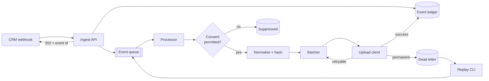
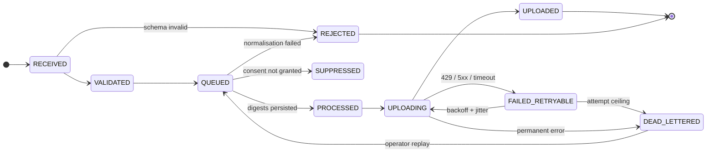

# First-Party Conversion Gateway

[](https://github.com/rajumohith50/conversion-gateway/actions/workflows/ci.yml)

An advertiser runs lead-generation campaigns, a user submits a form, and days
later a sales rep marks that lead closed-won in the CRM — but the ad platform
never hears about it, so it keeps optimising for form fills instead of
revenue. Closing the loop means sending the closed-won outcome back to the
platform, matched to the original click, without leaking personal data,
without uploading for users who did not consent, and without double-counting
when the CRM retries. This service does that: it receives CRM webhooks,
normalises and hashes the identifiers, gates on consent, and uploads offline
conversions with a durable, queryable record of where every event ended up.

> **Honesty note.** This is a reference implementation. It uploads to a
> [mock of the ad platform's API](mock_ads_api/) that speaks the real request
> and response shapes and fails on command — there is no advertiser account
> behind it. The upload client is an [interface](src/gateway/upload/client.py)
> with one HTTP implementation; pointing it at the real service is a base URL,
> a path, and an auth header, not a redesign. Everything upstream of that
> boundary — signature verification, the ledger, consent, normalisation,
> hashing, the queue, retries, partial-failure handling, dead-lettering,
> replay, metrics, redaction — is real and tested against real Postgres and a
> real Pub/Sub emulator.

The full technical design is in [docs/DESIGN.md](docs/DESIGN.md). A client
engineer integrating with this should read
[docs/INTEGRATION_GUIDE.md](docs/INTEGRATION_GUIDE.md); whoever is on call
should read [docs/RUNBOOK.md](docs/RUNBOOK.md).

## Architecture



Three processes share one Postgres ledger and one Pub/Sub topic:

| Process | Does | Never does |
| --- | --- | --- |
| **api** | Verifies the HMAC signature, validates the payload, writes the ledger row, publishes to the queue, answers in ~30 ms. | Hash, upload, or keep raw identifiers past the request. |
| **worker** | Consumes the queue, gates on consent, normalises and hashes, writes digests to the row. | See a raw identifier after this point. |
| **uploader** | Claims hashed rows from the ledger, batches, uploads with retry, records per-row outcomes, dead-letters permanent failures. | Re-send a row that already succeeded. |

Every state change is written to an append-only transitions table with a
timestamp and a reason code. "Where did event X end up and why" is one query,
and `GET /events/{id}` returns it.

## Quickstart

Requires Docker with Compose v2. Nothing else.

```
git clone https://github.com/rajumohith50/conversion-gateway
cd conversion-gateway
make up      # builds the image; starts postgres, pub/sub emulator, mock ads api,
             # runs migrations and queue setup, then api + worker + uploader
make seed    # posts seven webhooks and reports where each one ended up
```

`make up` takes about 20 seconds from a clean state. `make seed` should print:

```
event                                      http  expected       actual         reason
ok 1 salesforce, click id + identifiers     202  UPLOADED       UPLOADED       matched on click id
ok 2 hubspot, identifiers only              202  UPLOADED       UPLOADED       matched on hashed identifiers
ok 3 salesforce, consent denied             202  SUPPRESSED     SUPPRESSED     ad_user_data_denied
ok 4 hubspot, unparseable phone             202  REJECTED       REJECTED       unparseable:phone
ok 5 salesforce, unknown conversion action  202  DEAD_LETTERED  DEAD_LETTERED  permanent_row:CONVERSION_ACTION_NOT_FOUND
ok 6 event 1 delivered again                200  -              -              http 200: duplicate, no new row
ok 7 event 1, bad signature                 401  -              -              http 401: nothing written

every seeded event reached its expected state.
```

Then:

```
make dlq                                   # see event 5 in the dead-letter queue
make logs                                  # JSON logs from api, worker, uploader
curl localhost:8080/events/<event_id>      # lifecycle of any event
curl localhost:8081/uploads                # what the mock platform accepted
curl localhost:8080/metrics                # Prometheus
make down                                  # tear down, remove volumes
```

For development without containers: `make install`, `make run` (Postgres and
Pub/Sub only), `make migrate`, then `make api` / `make worker` / `make
uploader` / `make mock-api` in separate shells. `make test` needs `make run`.

## What happens to each seeded event

**1 — Salesforce, click id and identifiers, consent granted → `UPLOADED`.**
The API verifies `HMAC-SHA256("<timestamp>.<body>")` in constant time, maps
the PascalCase/`__c` payload into the canonical event, and writes
`RECEIVED → VALIDATED → QUEUED` in one transaction. After commit it publishes
`{event_id, raw identifiers, correlation_id}` to Pub/Sub — the only place the
raw identifiers ever travel. The worker loads the row, sees both consent
signals `GRANTED`, runs [`build_user_identifiers`](src/gateway/normalise/identifiers.py)
(gmail dots and `+tag` stripped, phone to E.164, name accents folded and
title `Dr.` dropped, every value SHA-256'd), writes the digests, and moves it
to `PROCESSED`. The uploader claims it with `FOR UPDATE SKIP LOCKED`, builds
the platform's request row with `gclid` plus hashed `userIdentifiers` and
`orderId = event_id`, and sends it. The mock validates every digest is
64-char lowercase hex, accepts it, and the row is `UPLOADED`.

**2 — HubSpot, identifiers only → `UPLOADED`.** Same path through a
completely different payload shape: camelCase, integer ids, epoch
milliseconds, every property a string. The mapper turns it into the same
canonical event; a [test](tests/api/test_mappers.py) asserts the two sources
produce byte-identical identifiers and consent. No click id, so
`match_key_type` is `user_identifiers` and the request carries only the
hashed identifiers. `+44 20 7946 0958` becomes `+442079460958` before
hashing.

**3 — Consent denied → `SUPPRESSED`.** The worker evaluates consent *before*
touching identifiers, so a denied user's PII is never even normalised.
`ad_user_data: DENIED` fails the gate; the row records
`status_reason = ad_user_data_denied` and `events_suppressed_total` increments
with that reason. The [gate](src/gateway/consent/gate.py) distinguishes
*denied* from *unspecified* from *absent*: a spike in `_missing` means the
client's tag stopped sending the field, which is the bug the metric exists to
catch.

**4 — Unparseable phone, no click id → `REJECTED`.** `"call me maybe"` is not
a phone number. The normaliser returns a typed `RejectionReason` rather than
a best-effort digest, because a hash of a badly-normalised value looks like a
valid upload and silently matches nothing. The row is terminal with
`status_reason = unparseable:phone`; the client sees the field name via
`GET /events`, never the value.

**5 — Unknown conversion action → `DEAD_LETTERED`.** Everything on our side
succeeds; the platform rejects the row with `CONVERSION_ACTION_NOT_FOUND`
because `contract_renewal` is not configured. This is the partial-failure
path: the batch also contained events 1 and 2, which were accepted. The
uploader maps the response's per-row results back by index, marks 1 and 2
`UPLOADED`, and dead-letters only 5 — **the batch is never re-sent**, so 1
and 2 are never uploaded twice. A [`dead_letters`](src/gateway/dlq/store.py)
row holds the exact payload sent, the platform's error, and the full attempt
history. `make dlq` shows it; once the action is configured,
`gateway dlq replay --id 1` sends it back through the pipeline and it uploads.

**6 — Event 1 delivered again → `200`, no new row.** CRMs retry. The insert
is `ON CONFLICT DO NOTHING RETURNING` in one statement, so even concurrent
duplicates cannot both win. The client gets the original id back and nothing
is published.

**7 — Event 1 with a bad signature → `401`, nothing written.** Unauthenticated
bodies never touch the database. The timestamp is inside the signed string,
so replaying a captured request with a fresh timestamp fails too.

## The parts that are easy to get wrong

| Problem | What this implementation does |
| --- | --- |
| **Hashing that silently doesn't match.** `" Mohith@Gmail.com "` and `mohith@gmail.com` hash to unrelated values; the upload succeeds and nothing matches. | Normalisation is a set of pure functions with a [fixture table](tests/normalise/test_normalise.py) of `(input, expected, digest)` rows that reads as the spec, including gmail dot/plus rules and *not* applying them to other domains. The mock rejects any digest that is not 64 lowercase hex characters. |
| **Best-effort normalisation.** A digest of a badly-normalised phone looks like a valid attempt and drags down measurable match rate. | Every normaliser returns either the value or a typed [`RejectionReason`](src/gateway/normalise/rejection.py). A rejected record carries every failing field, not just the first. |
| **Consent that fails open.** Missing consent fields treated as "probably fine". | Upload only on explicit `GRANTED` for both signals; *denied*, *unspecified* and *absent* are separate metric labels. |
| **Duplicate webhooks becoming duplicate conversions.** | `event_id` is the primary key; the insert is `ON CONFLICT DO NOTHING RETURNING`. Every conversion also carries `orderId = event_id` so the platform dedupes any re-send. |
| **Retrying the whole batch on a partial failure.** The rows that succeeded get uploaded again. | Per-row results mapped back by index; successes are `UPLOADED` and never re-claimed. A [test](tests/upload/test_uploader.py) asserts the exact order ids in every request. |
| **Retrying permanent errors.** A 401 retried six times burns quota and delays valid traffic. | Classification at the HTTP edge, before the retry decision. Only transient classes reach tenacity (exponential backoff, full jitter, attempt and elapsed-time caps). |
| **Replayable signatures.** A tolerance window on a timestamp header is bypassed by bumping the header. | The timestamp is inside the signed string. |
| **Lost messages with no trace.** Ledger commit and queue publish cannot share a transaction. | Commit first, publish second; `gateway reconcile` finds `QUEUED` rows with no progress and re-enqueues the recoverable ones. |
| **Rejections vanishing into a 4xx.** | Authenticated-but-invalid requests are written as `REJECTED` with structured reasons, queryable by id. |
| **PII in logs.** A debug line that dumps the payload, once. | [Redaction](src/gateway/observability/logging.py) is a structlog processor on the logger and the stdlib root, not a helper call sites have to remember. |
| **"Where is my conversion?" with no way to answer.** | One correlation id from ingest, returned to the caller, persisted, carried on the queue, bound in every process. `grep` it across three logs. |

## Observability

Metrics (Prometheus, labelled by `source` and `conversion_action`):
`events_received_total`, `events_rejected_total{reason}`,
`events_suppressed_total{reason}`, `conversions_uploaded_total`,
`conversions_dead_lettered_total{failure_class}`, `upload_latency_seconds`,
`dlq_depth`, `ingest_to_upload_seconds`. The API serves `/metrics`; the
worker and uploader serve their own on `:9091` and `:9092`.

Logs are JSON lines with the correlation id on every one. The
[runbook](docs/RUNBOOK.md) has the alert rules and what to do about each.

## Event lifecycle



The state machine is [data](src/gateway/models/status.py) and the ledger
refuses any transition not listed in it.

## Repository

```
src/gateway/
├── api/            FastAPI app, routes, signature verification, per-source schemas, mappers
├── models/         Canonical event, SQLAlchemy ledger + dead-letter models, lifecycle state machine
├── normalise/      Pure normalisation and hashing; rejection reasons
├── consent/        Consent gate
├── ledger.py       All ledger writes; the only code that changes event state
├── queue/          QueuePublisher / QueueConsumer; in-memory and Pub/Sub implementations
├── processor.py    What happens to one queued event: consent, normalise, persist
├── worker.py       The receive / process / ack loop
├── upload/         UploadClient interface + HTTP impl, batcher, classifier, retry policy, uploader loop
├── dlq/            Dead-letter store and replay
├── observability/  Prometheus metrics; structlog config with the PII redaction processor
├── cli.py          gateway worker | uploader | reconcile | queue-init | seed | dlq list/show/replay
├── seed.py         The demo mix
└── wiring.py       Builds the queue objects Settings asks for
mock_ads_api/       Configurable mock of the platform's upload endpoint
migrations/         Alembic
tests/              Fixture tables, state machine, HTTP integration against Postgres, end-to-end seed
docs/               DESIGN.md · INTEGRATION_GUIDE.md · RUNBOOK.md
Dockerfile          Multi-stage, non-root, one image for every service
docker-compose.yml  The whole system
.github/workflows/  Lint, typecheck, tests against Postgres + Pub/Sub emulator, image build
```

```
make test      # 364 tests · 98% line and branch coverage · needs `make run`
make lint      # ruff check + format check
make typecheck # mypy --strict
```

## Stack

Python 3.11 · FastAPI · Pydantic v2 · SQLAlchemy 2 · Alembic · Postgres ·
Google Cloud Pub/Sub · httpx · tenacity · structlog · prometheus-client ·
typer · phonenumbers · pytest · ruff · mypy --strict · uv · Docker Compose ·
GitHub Actions
