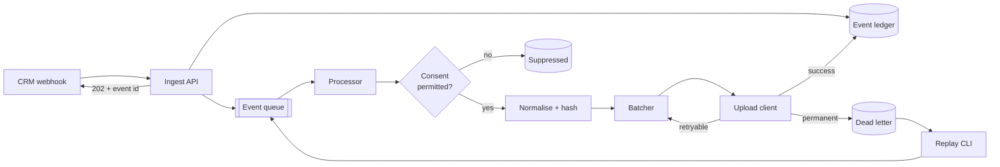

# First-Party Conversion Gateway

## Technical Design Document

**Status:** Reference implementation
**Author:** Mohith Gadiraju
**Last updated:** September 2026

---

## 1. Problem

An advertiser runs lead-generation campaigns. A user clicks an ad, lands on the
site, and submits a lead form. That form submission lands in the advertiser's
CRM. Days or weeks later, a sales rep marks the lead closed-won.

The ad platform never learns about that outcome. It optimised bidding against the
form submission, which is a weak proxy: most form fills never become revenue, and
the ones that do vary wildly in value. Without the downstream outcome, the
platform is optimising for the wrong thing.

Closing that loop requires pushing the closed-won event back to the ad platform,
matched to the original ad interaction. Two matching paths exist:

- **Click-ID matching.** The click identifier captured at form submission is
  stored on the CRM record and sent back with the conversion.
- **Identifier matching (Enhanced Conversions for Leads).** No click ID is
  available, so hashed first-party identifiers (email, phone, name, address) are
  sent instead and matched against signed-in users on the platform side.

Both paths sound simple and are not. The failure modes are the interesting part:
CRM webhooks arrive out of order and duplicate, consent state must gate whether
data may be sent at all, raw PII must never leave the boundary unhashed, hashing
is only correct if normalisation is byte-exact, and the upload API fails in ways
that are sometimes retryable and sometimes not.

## 2. What this system does

A server-side gateway that receives CRM lead events, normalises and hashes the
identifiers, gates on consent, and uploads conversions to an ad platform's
offline conversion endpoint with durability guarantees.

### In scope

- Webhook ingestion from Salesforce-shaped and HubSpot-shaped payloads
- Signature verification and replay protection
- Schema validation with explicit rejection reasons
- Idempotent processing and deduplication
- Consent gating per event
- PII normalisation and SHA-256 hashing
- Batched, retried upload with partial-failure handling
- Dead-letter queue with inspection and replay
- Metrics, structured logging, and a runbook

### Not in scope

- Client-side tagging (the browser side of the tag is assumed to exist)
- Identity resolution or cross-device stitching
- Attribution modelling
- A real ad platform account. The upload client speaks the real request and
  response shapes against a local mock server. Swapping in a live client is a
  configuration change and one adapter implementation.

## 3. Architecture



### Why a queue

The webhook handler must acknowledge fast. CRM platforms retry aggressively on
slow responses and disable endpoints that time out repeatedly. Acknowledging
after validation but before processing keeps the handler at low, predictable
latency and decouples ingest throughput from upload throughput, which is
rate-limited on the platform side.

The trade-off is that a client receiving a 202 has no guarantee the conversion
was uploaded. The event ledger exists so that state is queryable after the fact.

### Components

| Component | Responsibility |
| --- | --- |
| Ingest API | Verify signature, validate schema, dedupe, persist, enqueue, ack |
| Event ledger | Durable record of every event and its terminal state |
| Processor | Consume, gate on consent, normalise, hash, batch |
| Upload client | Speak the platform's upload API, classify errors, retry |
| Dead-letter store | Permanently failed events with structured failure reason |
| Replay CLI | Inspect the DLQ, re-enqueue after a fix |

## 4. Data model

### Event lifecycle

```
RECEIVED -> VALIDATED -> {SUPPRESSED | QUEUED} -> UPLOADING
         -> {UPLOADED | FAILED_RETRYABLE | DEAD_LETTERED}
```

Every state transition is written to the ledger with a timestamp and a reason
code. "Where did event X end up and why" is answerable with one query. That is
the single most useful property of the system when a client calls to ask why
their conversions are not showing up.

### Ledger record

| Field | Notes |
| --- | --- |
| `event_id` | Idempotency key. Sourced from the CRM event id |
| `source` | `salesforce` \| `hubspot` |
| `received_at` | Ingest timestamp |
| `conversion_action` | Which conversion the event maps to |
| `conversion_time` | When the outcome occurred, not when we received it |
| `conversion_value`, `currency` | Optional |
| `match_key_type` | `click_id` \| `user_identifiers` |
| `hashed_identifiers` | JSON. Hashes only |
| `consent_ad_user_data`, `consent_ad_personalization` | `GRANTED` \| `DENIED` \| `UNSPECIFIED` |
| `status`, `status_reason` | Current lifecycle state |
| `attempt_count`, `last_attempt_at` | Retry bookkeeping |

Raw PII is never persisted. Normalisation and hashing happen in memory in the
processor; only digests are written. The ingest API holds the raw payload only
for the duration of the request.

## 5. Normalisation and hashing

Hashing is the part everyone gets wrong. A hash of `" Mohith@Gmail.com "` and a
hash of `mohith@gmail.com` are unrelated values. Match rates collapse and the
failure is silent: the upload succeeds, and nothing matches.

Rules implemented, each with its own unit test and a fixture table:

**Email**
1. Trim surrounding whitespace
2. Lowercase
3. For `gmail.com` and `googlemail.com`, remove dots in the local part and
   truncate at the first `+`
4. SHA-256, lowercase hex

**Phone**
1. Parse to E.164 using the record's country as a default region
2. Reject if unparseable rather than sending a malformed digest
3. SHA-256 of the E.164 string including the leading `+`

**Given and family name**
1. Trim, lowercase
2. Strip punctuation and accents to their base characters
3. Remove titles and suffixes from a small fixture list
4. SHA-256

**Postal code and country** are sent unhashed. **Street address** is normalised
then hashed. Region and city are lowercased and sent unhashed.

Two design decisions worth stating:

- Normalisation failures are **rejections**, not best-effort passes. Sending a
  digest of a badly-normalised value is worse than sending nothing, because it
  looks like a valid attempt and drags down measurable match rate.
- The normaliser is a pure function with no I/O, so the fixture table is the
  specification. When platform rules change, one table changes.

## 6. Consent

Each event carries `ad_user_data` and `ad_personalization` signals. The gate is
explicit and fails closed:

- Both `GRANTED`: upload with identifiers
- `ad_user_data` denied or unspecified: do not upload. Record as `SUPPRESSED`
  with the reason
- Consent fields absent entirely: treat as unspecified, suppress, and count it.
  A rising suppression rate from a given source is a client-side tagging problem
  and the metric is how you catch it

Suppressed events stay in the ledger. If consent is later granted and the client
backfills, the events can be replayed.

## 7. Failure handling

### Error classification

| Class | Examples | Action |
| --- | --- | --- |
| Transient | 429, 500, 503, timeout, connection reset | Retry with backoff |
| Partial | Batch accepted, some rows rejected | Retry nothing. Dead-letter the rejected rows individually |
| Permanent | Invalid conversion action, malformed identifier, unauthorised | Dead-letter immediately |
| Poison | Repeated transient failures past the attempt ceiling | Dead-letter with the last error |

Retries use exponential backoff with full jitter, capped attempts, and a maximum
elapsed time. Retrying a permanent failure burns quota and delays valid traffic
behind it, so classification happens before the retry decision, not after.

### Partial batch failures

The upload endpoint accepts a batch and returns per-row results. A naive
implementation retries the whole batch on any failure, which double-uploads the
rows that succeeded. The client maps results back to rows by index and acts per
row. This is the specific bug most reference implementations have.

### Dead-letter queue

Dead-lettered events carry the original normalised payload, the failure class,
the platform's error message, and the attempt history. The replay CLI supports
filtering by reason and re-enqueueing a selection, which is what you actually do
after fixing a conversion action mapping.

## 8. Observability

Metrics, all labelled by source and conversion action:

- `events_received_total`
- `events_rejected_total` by rejection reason
- `events_suppressed_total` by consent reason
- `conversions_uploaded_total`
- `conversions_dead_lettered_total` by failure class
- `upload_latency_seconds` histogram
- `dlq_depth` gauge
- `ingest_to_upload_seconds` histogram

The last one is the number a client asks about: how long between the sales rep
marking closed-won and the platform knowing.

Logs are structured JSON with a correlation id threaded from ingest through
upload. A PII redaction filter is applied at the logger, not at each call site,
so a careless log statement cannot leak a raw email.

## 9. Security

- Webhook signature verification using HMAC-SHA256 over the raw body, with
  constant-time comparison
- Timestamp tolerance window to reject replayed requests
- Secrets from environment, never committed. `.env.example` documents the shape
- No raw PII in logs, in the ledger, or in error messages
- Container runs as a non-root user

## 10. Trade-offs and what a production version would change

| Decision | Reason | Production alternative |
| --- | --- | --- |
| Single queue, single consumer group | Keeps local setup to one command | Partition by source, scale consumers independently |
| Postgres for ledger and DLQ | One dependency, transactional | Ledger to a warehouse for analytics, DLQ to its own topic |
| Mock upload server | No advertiser account required | Real API client behind the same adapter interface |
| Synchronous hashing in the processor | Simple and cheap | Unchanged. Hashing is not the bottleneck |
| At-least-once delivery | Simpler than exactly-once | Unchanged. Idempotency keys on the platform side make duplicates harmless |

The at-least-once choice is deliberate. Exactly-once across a network boundary
is not achievable; the honest design is at-least-once delivery plus an
idempotency key the receiver deduplicates on.

## 11. Testing

- **Unit:** normalisation fixture table, consent gate truth table, error
  classifier, backoff calculation
- **Integration:** webhook through to mock upload, using a real Postgres and
  real queue in containers
- **Failure injection:** mock server configurable to return 429, 500, partial
  failures, and malformed responses, asserting the DLQ and metrics land correctly
- **Idempotency:** the same webhook delivered three times produces one upload

## 12. Repository layout

```
.
├── README.md
├── docs/
│   ├── DESIGN.md                 # this document
│   ├── INTEGRATION_GUIDE.md      # what a client must send, and why
│   └── RUNBOOK.md                # operating procedures
├── src/gateway/
│   ├── api/                      # FastAPI app, webhook routes, signature auth
│   ├── models/                   # Pydantic schemas, SQLAlchemy models
│   ├── normalise/                # pure normalisation and hashing functions
│   ├── consent/                  # consent gate
│   ├── queue/                    # queue adapter interface + implementations
│   ├── upload/                   # upload client, batching, retry, classifier
│   ├── dlq/                      # dead-letter store and replay
│   └── observability/            # logging, metrics, redaction
├── mock_ads_api/                 # configurable mock upload endpoint
├── tests/
├── docker-compose.yml
├── Makefile
└── .env.example
```
